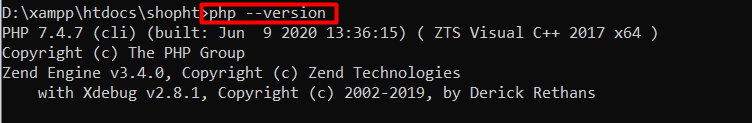
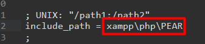
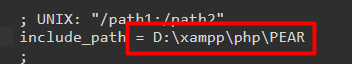
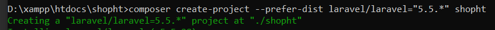
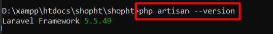
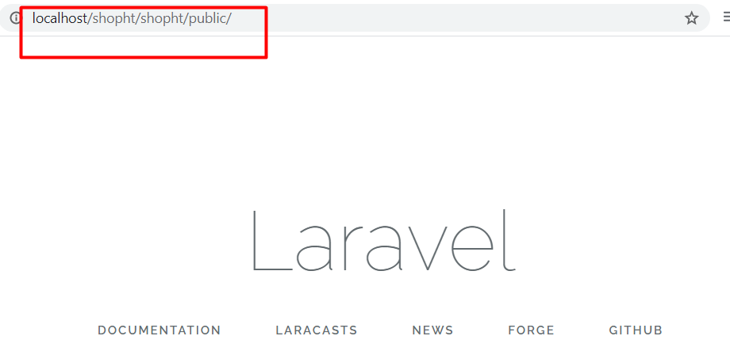
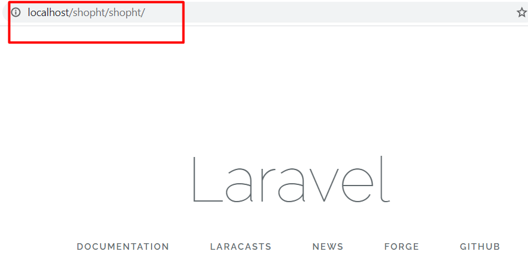
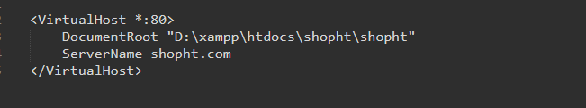
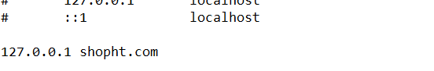
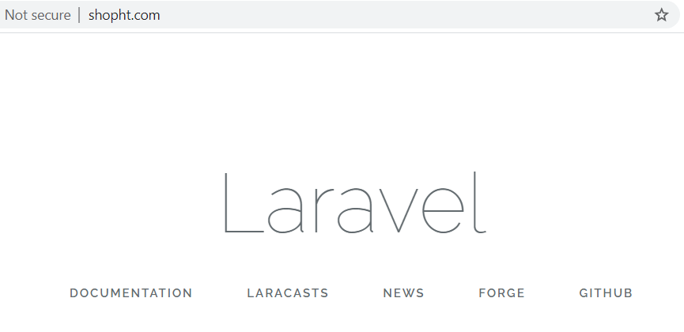

---

## LARAVEL

---

Window version 1909

PHP version 7.4.7

Laravel version 5.5.49

---

## Update PHP

[Download xampp new](https://www.apachefriends.org/index.html)

Or update 3 Folder new:

+ apache

+ php

+ phpMyAdmin

Check version PHP

```
php --version
```



Set seting in file ```xampp\php\php.ini```



To



---

## Install Laravel

```
composer create-project --prefer-dist laravel/laravel="5.5.*" shopht
```



Check version Laravel

```
php artisan --version
```



Run Browser url



Copy file ```xampp\htdocs\shopht\shopht\public\.htaccess``` to ```\xampp\htdocs\shopht\shopht```

Copy and Pase file ```xampp\htdocs\shopht\shopht\server.php``` edit name file ```xampp\htdocs\shopht\shopht\index.php```

Run Browser



#### + Create VirtualHost in xampp

Open file ```xampp\apache\conf\extra\httpd-vhosts.conf```

Edit



Add the line "127.0.0.1 shopht.com" to the host file



Restart xampp and open Browser



---

## Routing

+ #### Create page: about, contact, welcome and master

	+ Create welcome.blade.php

	```php
	<h1>Welcome to Page Home</h1>
	<a href="{{ url('/about') }}">About</a>
	<a href="{{ url('/contact') }}">Contact</a>
	```

	+ Create master.blade.php

	```html
	<!DOCTYPE html>
	<html>
	<head>
		<title>Shop boot HT</title>
	</head>
	<body>
		@section('sidebar')
		<p>This is parent/ Master Page</p>
		@show
		<div>
			@yield('component')
		</div>
	</body>
	</html>
	```

	+ create about.blade.php

	```php
	@extends('master')
	@section('sidebar')
		@parent
		<p>This About Sidebar</p>
	@endsection
	@section('component')
		<h1>About Us Page</h1>
	@endsection
	```

	+ Create contact.blade.php

	```php
	@extends('master')
	@section('sidebar')
		<p>This Contact Page</p>
		@parent
	@endsection
	@section('component')
		<h1>Page Contact</h1>
	@endsection
	```